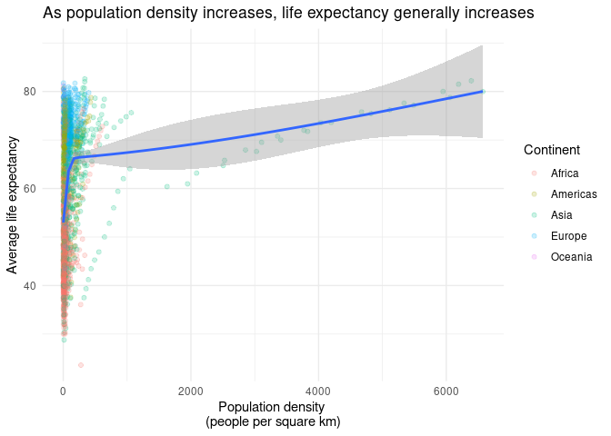
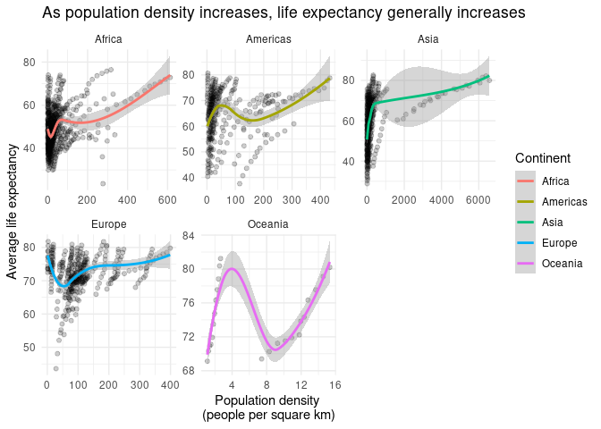

Effect of Population Density on Life Expectancy
================
Julia Du
2021-03-07

  - [Load necessary libraries](#load-necessary-libraries)
  - [Country info from geonames](#country-info-from-geonames)
  - [Visualizations](#visualizations)
  - [Linear model w/ 10-folds](#linear-model-w-10-folds)
  - [Session info](#session-info)

## Load necessary libraries

``` r
library(tidyverse)
library(geonames)
library(countrycode)
library(gapminder)
library(tidymodels)

theme_set(theme_minimal())
```

## Country info from geonames

We know that `geonames` data stores countries using the iso2c format, so
we’ll convert the `gapminder` country names to be in iso2c format as
well. Since `gapminder` tracks countries through multiple points in
times, it has multiple rows for each country. `geonames` on the other
hand only has 1 row for each country & includes info on the square area
of the country. When we join these 2 dataframes, we’ll want to have
`gapminder` on the left because it has multiple rows for each country.

**Note**: be sure to register for an API key with the geonames.org
website. You’ll need this key (in this case, your username) to access
the info from geonames. Before running the code you see below, you’ll
need to open your .Rprofile with `file.edit(here::here(".Rprofile"))`.
Then, add your geonames username to the .Rprofile with
`options(geonamesUsername = "my_user_name")`.

``` r
countryInfo <- GNcountryInfo()
gap <- gapminder

# convert country name format for gapminder
gap$country <- countrycode(gap$country, origin = "country.name", destination = "iso2c")

countryInfo <- countryInfo %>%
  mutate(areaInSqKm = as.numeric(areaInSqKm)) %>%
  rename(area = areaInSqKm, country = countryCode)

# calculate pop density
joined_country <- left_join(gap, countryInfo, by = "country") %>%
  mutate(popdensity = pop/area) 

neat_join <- joined_country %>%
  select(countryName, continent.x, year, lifeExp, popdensity)

neat_join
```

    ## # A tibble: 1,704 x 5
    ##    countryName                     continent.x  year lifeExp popdensity
    ##    <chr>                           <fct>       <int>   <dbl>      <dbl>
    ##  1 Islamic Republic of Afghanistan Asia         1952    28.8       13.0
    ##  2 Islamic Republic of Afghanistan Asia         1957    30.3       14.3
    ##  3 Islamic Republic of Afghanistan Asia         1962    32.0       15.9
    ##  4 Islamic Republic of Afghanistan Asia         1967    34.0       17.8
    ##  5 Islamic Republic of Afghanistan Asia         1972    36.1       20.2
    ##  6 Islamic Republic of Afghanistan Asia         1977    38.4       23.0
    ##  7 Islamic Republic of Afghanistan Asia         1982    39.9       19.9
    ##  8 Islamic Republic of Afghanistan Asia         1987    40.8       21.4
    ##  9 Islamic Republic of Afghanistan Asia         1992    41.7       25.2
    ## 10 Islamic Republic of Afghanistan Asia         1997    41.8       34.3
    ## # … with 1,694 more rows

## Visualizations

``` r
joined_country %>%
  ggplot(mapping = aes(x = popdensity, y = lifeExp)) +
  geom_point(aes(color = continent.x), alpha = 0.2) +
  geom_smooth() + 
  labs(title = "As population density increases, life expectancy generally increases", 
       x = "Population density \n(people per square km)", 
       y = "Average life expectancy", color = "Continent")
```

<!-- -->

``` r
joined_country %>%
  ggplot(mapping = aes(x = popdensity, y = lifeExp)) +
  geom_point(alpha = 0.2) +
  geom_smooth(aes(color = continent.x)) +
  facet_wrap(~ continent.x, scales = "free") +
  labs(title = "As population density increases, life expectancy generally increases", 
       x = "Population density \n(people per square km)", 
       y = "Average life expectancy", color = "Continent")
```

<!-- -->

Life expectancy does tend to increase with population density, with an
extremely sharp jump from 55 years to about 75 years when we move from a
population density of near 25 people per sq. km to about 250 people per
sq. km.

In our faceted graph, there are some fluctuations, but life expectancy
generally increases sharply at lower ranges of population densities &
then increases more gradually. We see that Oceania looks a bit strange,
but that likely is due to its extremely small number of observations.
Asia also stands out for having some extremely high population density
values, e.g. 6000 people per sq. km, much higher than the other
continents. These extreme values seem to be from a few select countries,
however, and not a general trend for the Asian continent; most Asian
countries are clustered between a population density of 0 and 500 people
per sq. km, higher than other continents but much closer than a density
of 6000 people per sq. km. Europe also seems to have the highest life
expectancies overall.

## Linear model w/ 10-folds

``` r
set.seed(123)

lm_mod <- linear_reg() %>% 
  set_engine("lm")

country_split <- initial_split(neat_join)
country_train <- training(country_split)
country_test <- testing(country_split)
folds <- vfold_cv(country_train, v = 10)

country_wf <- workflow() %>%
  add_model(lm_mod) %>%
  add_formula(lifeExp ~ popdensity) 

country_fit_rs <- country_wf %>%
  fit_resamples(folds)

country_fit_rs %>%
  collect_metrics()
```

    ## # A tibble: 2 x 6
    ##   .metric .estimator    mean     n std_err .config             
    ##   <chr>   <chr>        <dbl> <int>   <dbl> <chr>               
    ## 1 rmse    standard   12.6       10 0.144   Preprocessor1_Model1
    ## 2 rsq     standard    0.0389    10 0.00207 Preprocessor1_Model1

It looks like predicting life expectancy based on population density
alone is a poor idea, at least with a linear model. The RMSE
(i.e. differences between observed values and model-predicted values of
life expectancy) is quite high around 12.61, given that there are a
bunch of points with population density between 0 and 100 people per sq.
km. The R^2 (i.e. the variance in life expectancy explained by the
model) is very low at 3%, further indicating that this linear model
isn’t great.

## Session info

``` r
devtools::session_info()
```

    ## ─ Session info ───────────────────────────────────────────────────────────────
    ##  setting  value                               
    ##  version  R version 4.0.1 (2020-06-06)        
    ##  os       Red Hat Enterprise Linux 8.3 (Ootpa)
    ##  system   x86_64, linux-gnu                   
    ##  ui       X11                                 
    ##  language (EN)                                
    ##  collate  en_US.UTF-8                         
    ##  ctype    en_US.UTF-8                         
    ##  tz       America/Chicago                     
    ##  date     2021-03-07                          
    ## 
    ## ─ Packages ───────────────────────────────────────────────────────────────────
    ##  package     * version    date       lib source        
    ##  assertthat    0.2.1      2019-03-21 [2] CRAN (R 4.0.1)
    ##  backports     1.2.1      2020-12-09 [2] CRAN (R 4.0.1)
    ##  broom       * 0.7.3      2020-12-16 [2] CRAN (R 4.0.1)
    ##  callr         3.5.1      2020-10-13 [2] CRAN (R 4.0.1)
    ##  cellranger    1.1.0      2016-07-27 [2] CRAN (R 4.0.1)
    ##  class         7.3-17     2020-04-26 [2] CRAN (R 4.0.1)
    ##  cli           2.2.0      2020-11-20 [2] CRAN (R 4.0.1)
    ##  codetools     0.2-16     2018-12-24 [2] CRAN (R 4.0.1)
    ##  colorspace    2.0-0      2020-11-11 [2] CRAN (R 4.0.1)
    ##  countrycode * 1.2.0      2020-05-22 [2] CRAN (R 4.0.1)
    ##  crayon        1.3.4      2017-09-16 [2] CRAN (R 4.0.1)
    ##  DBI           1.1.0      2019-12-15 [2] CRAN (R 4.0.1)
    ##  dbplyr        2.0.0      2020-11-03 [2] CRAN (R 4.0.1)
    ##  desc          1.2.0      2018-05-01 [2] CRAN (R 4.0.1)
    ##  devtools      2.3.2      2020-09-18 [1] CRAN (R 4.0.1)
    ##  dials       * 0.0.9      2020-09-16 [2] CRAN (R 4.0.1)
    ##  DiceDesign    1.8-1      2019-07-31 [2] CRAN (R 4.0.1)
    ##  digest        0.6.27     2020-10-24 [2] CRAN (R 4.0.1)
    ##  dplyr       * 1.0.2      2020-08-18 [2] CRAN (R 4.0.1)
    ##  ellipsis      0.3.1      2020-05-15 [2] CRAN (R 4.0.1)
    ##  evaluate      0.14       2019-05-28 [2] CRAN (R 4.0.1)
    ##  fansi         0.4.1      2020-01-08 [2] CRAN (R 4.0.1)
    ##  farver        2.0.3      2020-01-16 [2] CRAN (R 4.0.1)
    ##  forcats     * 0.5.0      2020-03-01 [2] CRAN (R 4.0.1)
    ##  foreach       1.5.1      2020-10-15 [2] CRAN (R 4.0.1)
    ##  fs            1.5.0      2020-07-31 [2] CRAN (R 4.0.1)
    ##  furrr         0.2.1      2020-10-21 [2] CRAN (R 4.0.1)
    ##  future        1.21.0     2020-12-10 [2] CRAN (R 4.0.1)
    ##  gapminder   * 0.3.0      2017-10-31 [2] CRAN (R 4.0.1)
    ##  generics      0.1.0      2020-10-31 [2] CRAN (R 4.0.1)
    ##  geonames    * 0.999      2019-02-19 [2] CRAN (R 4.0.1)
    ##  ggplot2     * 3.3.3      2020-12-30 [2] CRAN (R 4.0.1)
    ##  globals       0.14.0     2020-11-22 [2] CRAN (R 4.0.1)
    ##  glue          1.4.2      2020-08-27 [2] CRAN (R 4.0.1)
    ##  gower         0.2.2      2020-06-23 [2] CRAN (R 4.0.1)
    ##  GPfit         1.0-8      2019-02-08 [2] CRAN (R 4.0.1)
    ##  gtable        0.3.0      2019-03-25 [2] CRAN (R 4.0.1)
    ##  hardhat       0.1.5      2020-11-09 [2] CRAN (R 4.0.1)
    ##  haven         2.3.1      2020-06-01 [2] CRAN (R 4.0.1)
    ##  hms           0.5.3      2020-01-08 [2] CRAN (R 4.0.1)
    ##  htmltools     0.5.1.1    2021-01-22 [1] CRAN (R 4.0.1)
    ##  httr          1.4.2      2020-07-20 [2] CRAN (R 4.0.1)
    ##  infer       * 0.5.3      2020-07-14 [2] CRAN (R 4.0.1)
    ##  ipred         0.9-9      2019-04-28 [2] CRAN (R 4.0.1)
    ##  iterators     1.0.13     2020-10-15 [2] CRAN (R 4.0.1)
    ##  jsonlite      1.7.2      2020-12-09 [2] CRAN (R 4.0.1)
    ##  knitr         1.30       2020-09-22 [2] CRAN (R 4.0.1)
    ##  labeling      0.4.2      2020-10-20 [2] CRAN (R 4.0.1)
    ##  lattice       0.20-41    2020-04-02 [2] CRAN (R 4.0.1)
    ##  lava          1.6.8.1    2020-11-04 [2] CRAN (R 4.0.1)
    ##  lhs           1.1.1      2020-10-05 [2] CRAN (R 4.0.1)
    ##  lifecycle     0.2.0      2020-03-06 [2] CRAN (R 4.0.1)
    ##  listenv       0.8.0      2019-12-05 [2] CRAN (R 4.0.1)
    ##  lubridate     1.7.9.2    2020-11-13 [2] CRAN (R 4.0.1)
    ##  magrittr      2.0.1      2020-11-17 [2] CRAN (R 4.0.1)
    ##  MASS          7.3-51.6   2020-04-26 [2] CRAN (R 4.0.1)
    ##  Matrix        1.2-18     2019-11-27 [2] CRAN (R 4.0.1)
    ##  memoise       1.1.0      2017-04-21 [2] CRAN (R 4.0.1)
    ##  mgcv          1.8-31     2019-11-09 [2] CRAN (R 4.0.1)
    ##  modeldata   * 0.1.0      2020-10-22 [2] CRAN (R 4.0.1)
    ##  modelr        0.1.8      2020-05-19 [2] CRAN (R 4.0.1)
    ##  munsell       0.5.0      2018-06-12 [2] CRAN (R 4.0.1)
    ##  nlme          3.1-148    2020-05-24 [2] CRAN (R 4.0.1)
    ##  nnet          7.3-14     2020-04-26 [2] CRAN (R 4.0.1)
    ##  parallelly    1.22.0     2020-12-13 [2] CRAN (R 4.0.1)
    ##  parsnip     * 0.1.4      2020-10-27 [2] CRAN (R 4.0.1)
    ##  pillar        1.4.7      2020-11-20 [2] CRAN (R 4.0.1)
    ##  pkgbuild      1.2.0      2020-12-15 [2] CRAN (R 4.0.1)
    ##  pkgconfig     2.0.3      2019-09-22 [2] CRAN (R 4.0.1)
    ##  pkgload       1.1.0      2020-05-29 [2] CRAN (R 4.0.1)
    ##  plyr          1.8.6      2020-03-03 [2] CRAN (R 4.0.1)
    ##  prettyunits   1.1.1      2020-01-24 [2] CRAN (R 4.0.1)
    ##  pROC          1.16.2     2020-03-19 [2] CRAN (R 4.0.1)
    ##  processx      3.4.5      2020-11-30 [2] CRAN (R 4.0.1)
    ##  prodlim       2019.11.13 2019-11-17 [2] CRAN (R 4.0.1)
    ##  ps            1.5.0      2020-12-05 [2] CRAN (R 4.0.1)
    ##  purrr       * 0.3.4      2020-04-17 [2] CRAN (R 4.0.1)
    ##  R6            2.5.0      2020-10-28 [2] CRAN (R 4.0.1)
    ##  Rcpp          1.0.5      2020-07-06 [2] CRAN (R 4.0.1)
    ##  readr       * 1.4.0      2020-10-05 [2] CRAN (R 4.0.1)
    ##  readxl        1.3.1      2019-03-13 [2] CRAN (R 4.0.1)
    ##  recipes     * 0.1.15     2020-11-11 [2] CRAN (R 4.0.1)
    ##  remotes       2.2.0      2020-07-21 [2] CRAN (R 4.0.1)
    ##  reprex        0.3.0      2019-05-16 [1] CRAN (R 4.0.1)
    ##  rjson         0.2.20     2018-06-08 [2] CRAN (R 4.0.1)
    ##  rlang       * 0.4.10     2020-12-30 [2] CRAN (R 4.0.1)
    ##  rmarkdown     2.7        2021-02-19 [1] CRAN (R 4.0.1)
    ##  rpart         4.1-15     2019-04-12 [2] CRAN (R 4.0.1)
    ##  rprojroot     2.0.2      2020-11-15 [2] CRAN (R 4.0.1)
    ##  rsample     * 0.0.8      2020-09-23 [2] CRAN (R 4.0.1)
    ##  rstudioapi    0.13       2020-11-12 [2] CRAN (R 4.0.1)
    ##  rvest         0.3.6      2020-07-25 [2] CRAN (R 4.0.1)
    ##  scales      * 1.1.1      2020-05-11 [2] CRAN (R 4.0.1)
    ##  sessioninfo   1.1.1      2018-11-05 [2] CRAN (R 4.0.1)
    ##  stringi       1.5.3      2020-09-09 [2] CRAN (R 4.0.1)
    ##  stringr     * 1.4.0      2019-02-10 [2] CRAN (R 4.0.1)
    ##  survival      3.1-12     2020-04-10 [2] CRAN (R 4.0.1)
    ##  testthat      3.0.1      2020-12-17 [2] CRAN (R 4.0.1)
    ##  tibble      * 3.0.4      2020-10-12 [2] CRAN (R 4.0.1)
    ##  tidymodels  * 0.1.2      2020-11-22 [1] CRAN (R 4.0.1)
    ##  tidyr       * 1.1.2      2020-08-27 [2] CRAN (R 4.0.1)
    ##  tidyselect    1.1.0      2020-05-11 [2] CRAN (R 4.0.1)
    ##  tidyverse   * 1.3.0      2019-11-21 [1] CRAN (R 4.0.1)
    ##  timeDate      3043.102   2018-02-21 [2] CRAN (R 4.0.1)
    ##  tune        * 0.1.2      2020-11-17 [2] CRAN (R 4.0.1)
    ##  usethis       2.0.0      2020-12-10 [1] CRAN (R 4.0.1)
    ##  utf8          1.1.4      2018-05-24 [2] CRAN (R 4.0.1)
    ##  vctrs       * 0.3.6      2020-12-17 [2] CRAN (R 4.0.1)
    ##  withr         2.3.0      2020-09-22 [2] CRAN (R 4.0.1)
    ##  workflows   * 0.2.1      2020-10-08 [2] CRAN (R 4.0.1)
    ##  xfun          0.19       2020-10-30 [2] CRAN (R 4.0.1)
    ##  xml2          1.3.2      2020-04-23 [2] CRAN (R 4.0.1)
    ##  yaml          2.2.1      2020-02-01 [2] CRAN (R 4.0.1)
    ##  yardstick   * 0.0.7      2020-07-13 [2] CRAN (R 4.0.1)
    ## 
    ## [1] /home/duj/R/x86_64-pc-linux-gnu-library/4.0
    ## [2] /opt/R/4.0.1/lib/R/library
