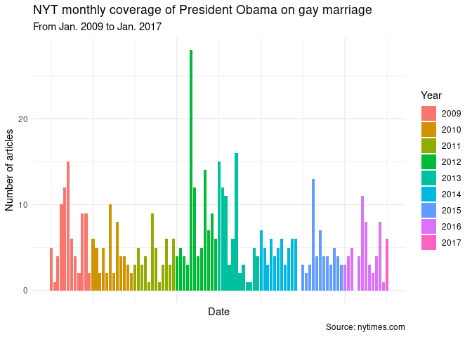

HW08, pt 2: Exploring NYT API
================
Julia Du
2021-03-08

  - [Load necessary libraries](#load-necessary-libraries)
  - [Overview](#overview)
      - [Using API for 1 pg of results](#using-api-for-1-pg-of-results)
      - [Iterating API use](#iterating-api-use)
  - [Visualizing NYT coverage](#visualizing-nyt-coverage)

**Note:** You’ll need to register for a NYT Developer account in order
to use their APIs, all of which require authentication. Before running
the code you see below, you’ll need to open your .Rprofile with
`file.edit(here::here(".Rprofile"))` and add your NYT API key to the
.Rprofile with `options(nyt_semantics_key = "my_user_name")`.

## Load necessary libraries

``` r
library(tidyverse)
library(stringr)
library(jsonlite)
library(httr)
library(lubridate)
library(glue)

nyt_key <- getOption("nyt_semantics_key")

theme_set(theme_minimal())
```

# Overview

The goal here was to look at how coverage of President Obama on gay
marriage fluctuated with time. I used the New York Times’s Article
Search API and heavily relied upon their
[documentation](https://developer.nytimes.com/docs/articlesearch-product/1/routes/articlesearch.json/get)
to figure out how to format my request. I also drew heavily from [this
site](https://plsc-31101.github.io/course/collecting-data-from-the-web.html#writing-api-queries).

## Using API for 1 pg of results

``` r
base.url <- "https://api.nytimes.com/svc/search/v2/articlesearch.json"
search_term <- "Obama gay marriage"
filter_query <- 'source:("The New York Times") AND news_desk:("National") 
AND section_name:("U.S.") AND document_type:("article")' 
begin <- "20090120" #Obama presidency start
end <- "20170120" #Obama presidency end

articles <- GET(base.url, 
                query = list(`q` = search_term,
                             `fq` = filter_query,
                             `begin_date` = begin,
                             `end_date` = end,
                             `api-key` = nyt_key))

response <- content(articles, "text")
```

    ## No encoding supplied: defaulting to UTF-8.

``` r
response_df <- fromJSON(response, simplifyDataFrame = TRUE, flatten = TRUE) 

docs <- response_df %>%
  with(response) 
# tidyverse alternative to response_df$response$docs, but struggled to use w/in a function

#extract total hits
hits <- response_df$response$meta$hits

# get number of pages
pages <- ceiling(hits/10)
```

## Iterating API use

I have set this chunk’s options to `message = FALSE` because I don’t
want to have all the messages in my knitted .md document. However, when
testing this code, I’d recommend setting `message = TRUE` so you have an
idea of what’s going on.

``` r
nyt_api <- function(term, pg){
  base.url <- "https://api.nytimes.com/svc/search/v2/articlesearch.json"
  filter_query <- 'source:("The New York Times") AND news_desk:("National") AND section_name:("U.S.") AND document_type:("article")'
  begin <- "20090120" #Obama term start
  end <- "20170120" #Obama term end
  
  # send GET request
  articles <- GET(base.url, 
                  query = list(`q` = term,
                               `fq` = filter_query,
                               `begin_date` = begin,
                               `end_date` = end,
                               `page` = pg,
                               `api-key` = nyt_key))
  
  # Parse response to JSON
  response <- content(articles, "text")
  
  response_df <- fromJSON(response, simplifyDataFrame = TRUE, flatten = TRUE) 

  message(glue("Scraping page {pg}"))
  
  return(response_df$response$docs)
  
}

#nyt_api(term = "gay marriage", pg = 4)

nyt_api_slow <- slowly(nyt_api, rate = rate_delay(6))

docs_df <- map_dfr((0:pages), ~nyt_api_slow(term = "Obama gay marriage", pg = .))
```

# Visualizing NYT coverage

``` r
date_docs <- docs_df %>%
  mutate(date = ymd_hms(pub_date), .before = abstract) %>% 
  count(floor_date(date, "month")) %>%
  rename(month = 1, count = n) %>%
  mutate(year = year(month), year = as.factor(year))

date_docs %>%
  ggplot(aes(x = month, y = count, fill = year)) +
  geom_col() +
  labs(title = "NYT monthly coverage of President Obama on gay marriage", subtitle = "From Jan. 2009 to Jan. 2017", x = "Date", y = "Number of articles", fill = "Year", caption = "Source: nytimes.com") +
  theme(axis.text.x = element_blank()) 
```

<!-- -->

There are several notable peaks in coverage, namely mid-2009,
early/mid-2012, 2013, and mid-2015.

In June 2009, Obama signed a [Presidential
Memo](https://www.pbs.org/wgbh/americanexperience/features/stonewall-milestones-american-gay-rights-movement/)
that let same-sex partners of federal employees receive specified
benefits. There were a lot of articles in early/mid-2012, likely because
it was an election year and gay marriage was one of the main issues
presidential candidates were evaluated on. I’m not too sure why there
were peaks in 2013, but the peak in 2015 was due to the historic Supreme
Court decision that declared gay marriage legal in the U.S.
