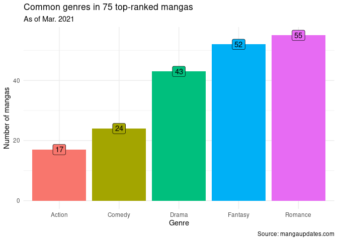
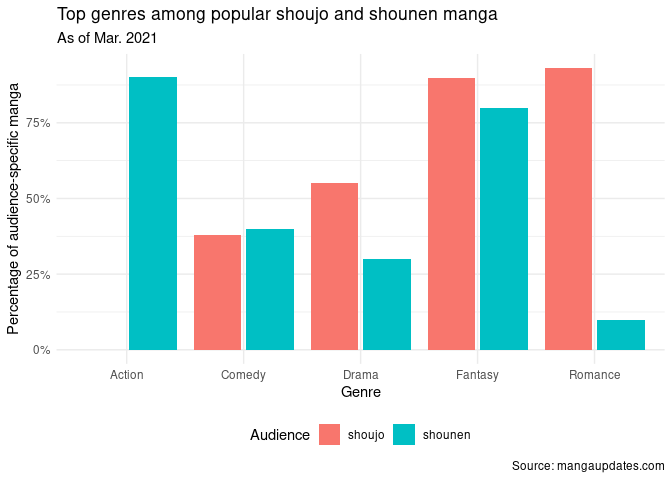

HW08, pt 2: Scraping mangaupdates.com
================
Julia Du
2021-03-08

  - [Load necessary libraries](#load-necessary-libraries)
  - [Overview](#overview)
  - [Scraping & cleaning data](#scraping--cleaning-data)
  - [Visualizations of data](#visualizations-of-data)
  - [Session info](#session-info)

## Load necessary libraries

``` r
library(tidyverse)
library(stringr)
library(rvest)
library(glue)

theme_set(theme_minimal())
```

## Overview

I embraced my weeb side and scraped www.mangaupdates.com to look at
common genres among the top-rated mangas in March 2021. As you’ll see
below, I store local copies of my scraped data so you can see how I get
my results, even if the website changes.

## Scraping & cleaning data

``` r
# create folder to store local copies of df
dir.create("./data")

multiple_manga <- function(pg){
  manga <- read_html(glue("https://www.mangaupdates.com/stats.html?page={pg}&"))

manga_nodes <- html_nodes(manga, ".text-truncate span , .text-truncate u, #main_content .text.text-center")

manga_vec <- manga_nodes %>%
  html_text() %>%
  purrr::discard(.p = ~stringr::str_detect(.x,"Rank"))
    
wip_manga <- split(manga_vec, ceiling(seq_along(manga_vec)/3)) %>%
  as_tibble()

# stores local copy of dataframe
wip_manga %>%
  write_csv(glue("./data/manga_df_pg{pg}.csv"))

# if using local copy, start the multiple_manga function here 
# (i.e. you don't need function to include code above this line, as that code scrapes the website)

almost_manga_df <- wip_manga %>%
  mutate(placeholder = c("rank", "title", "genre"), .before = 1) %>% 
  #could stop here
  mutate(row = row_number()) %>%
  filter(!row == "1") %>%
  pivot_longer(c(`1`:`25`), names_to = "rank", values_to = "values") %>%
  pivot_wider(names_from = placeholder, values_from = values) 

almost_manga_top <- almost_manga_df %>%
  slice_head(n = 25)

almost_manga_bottom <- almost_manga_df %>%
  slice_tail(n = 25)

neat_manga <- left_join(almost_manga_top, almost_manga_bottom, by = "rank") %>%
  select(-c(row.x, genre.x, title.y, row.y)) %>%
  rename(title = title.x, genre = genre.y) %>%
  mutate(rank = as.numeric(rank)) %>%
  mutate(rank = rank + 25*(pg-1))

neat_manga
}

# test function
multiple_manga(2)
```

    ## # A tibble: 25 x 3
    ##     rank title                                 genre                            
    ##    <dbl> <chr>                                 <chr>                            
    ##  1    26 Wonsureul Saranghara                   Drama, Josei, Romance           
    ##  2    27 Men of the Harem                       Drama, Fantasy, Harem, Josei, R…
    ##  3    28 The Reason Why Raeliana Ended up at …  Fantasy, Mystery, Romance, Shou…
    ##  4    29 I Fell into a Reverse Harem Game!      Fantasy, Harem, Romance, Shoujo 
    ##  5    30 The Boxer                              Action, Martial Arts, Seinen, S…
    ##  6    31 Valhalla Otintin-kan                   Adult, Fantasy, Harem, Seinen   
    ##  7    32 Stepmother's Friends                   Adult, Drama, Harem, Romance, S…
    ##  8    33 A Tender Heart: The Story of How I B…  Comedy, Drama, Fantasy, Romance…
    ##  9    34 The Lady and the Beast (Hongseul)      Fantasy, Historical, Josei, Rom…
    ## 10    35 I Am the Real One                      Drama, Fantasy, Shoujo          
    ## # … with 15 more rows

``` r
# iterate function to get multiple pgs of results
manga_pgs <- c(1, 2, 3)

manga_75 <- map_dfr(.x = manga_pgs, .f = multiple_manga)

# tidy df to be used for analysis
manga_75
```

    ## # A tibble: 75 x 3
    ##     rank title                     genre                                        
    ##    <dbl> <chr>                     <chr>                                        
    ##  1     1 Unholy Blood               Action, Fantasy, Romance, Slice of Life, Su…
    ##  2     2 Who Made Me a Princess     Comedy, Fantasy, Romance, Shoujo, Slice of …
    ##  3     3 I Woke Up as the Ugly Du…  Fantasy, Romance, Shoujo                    
    ##  4     4 The Beloved Little Princ…  Fantasy, Historical, Shoujo, Slice of Life  
    ##  5     5 I'll Be the Matriarch in…  Drama, Fantasy, Historical, Romance, Shoujo 
    ##  6     6 Tensei Shitara Slime Dat…  Action, Adventure, Comedy, Drama, Fantasy, …
    ##  7     7 Daddy, I Don't Want to M…  Drama, Fantasy, Romance, Shoujo             
    ##  8     8 Poison Dragon: The Legen…  Action, Adventure, Drama, Fantasy, Martial …
    ##  9     9 The Second Coming of Glu…  Action, Adventure, Drama, Fantasy, Harem, M…
    ## 10    10 Horimiya                   Comedy, Romance, School Life, Shounen, Slic…
    ## # … with 65 more rows

The `multiple_manga` function above stores a local copy of the scraped
dataframe. If you don’t want to scrape yourself, you can retrieve my
pre-stored local copy of dataframe through `wip_manga <-
read_csv("./data/SPECIFIC_DF_NAME.csv")` and then delete the code lines
of the `multiple_manga` function responsible for scraping.

(For your convenience, I added a comment on which lines of the function
are the scraping code.)

## Visualizations of data

``` r
# function to count how many mangas belong to certain genre
genre_count <- function(genre_string){
  manga_75 %>%
    filter(str_detect(genre, genre_string)) %>%
    count() %>%
    mutate(genre = genre_string)
}

genres_of_interest <- c("Action", "Comedy", "Drama", "Fantasy", "Romance")

# visualize manga overall
map_dfr(genres_of_interest, genre_count) %>%
  ggplot(mapping = aes(x = genre, y = n, fill = genre, label = n)) +
  geom_col() +
  labs(title = "Common genres in 75 top-ranked mangas", 
       subtitle = "As of Mar. 2021", 
       x = "Genre", y = "Number of mangas", fill = "", 
       caption = "Source: mangaupdates.com") +
  geom_label() +
  theme(legend.position = "none")
```

<!-- -->

**In case it isn’t clear, a manga can be listed as more than one
genre.** I scraped the 75 highest-ranked mangas and looked at the
frequency of specific genres I was interested in. I wasn’t surprised
that Romance and Fantasy were the most frequent genres, as manga tends
to really appeal to escapist tendencies.

``` r
# have to create new functions for counting shoujo & shounen manga
# because unable to map input vectors of diff lengths, even with pmap (as pmap = PARALLEL mapping)

# shoujo function 
shoujo_genre_count <- function(genre_string){
  length <- manga_75 %>%
  filter(str_detect(genre, "Shoujo")) %>%
  count() %>%
  pull()
  
  manga_75 %>%
    filter(str_detect(genre, "Shoujo")) %>%
    filter(str_detect(genre, genre_string)) %>%
    count() %>%
    mutate(genre = genre_string, percent = n/length, audience = "shoujo")
  }

shoujo_df <- map_dfr(genres_of_interest, shoujo_genre_count)

shounen_genre_count <- function(genre_string){
  length <- manga_75 %>%
  filter(str_detect(genre, "Shounen")) %>%
  count() %>%
  pull()
  
  manga_75 %>%
    filter(str_detect(genre, "Shounen")) %>%
    filter(str_detect(genre, genre_string)) %>%
    count() %>%
    mutate(genre = genre_string, percent = n/length, audience = "shounen")
  }

shounen_df <- map_dfr(genres_of_interest, shounen_genre_count)

# visualize shoujo vs shounen
shoujo_df %>%
  bind_rows(shounen_df) %>% 
  ggplot(aes(x = genre, y = percent, fill = audience)) +
  geom_col(position = position_dodge2(width = 0.9, preserve = "single")) +
  labs(title = "Top genres among popular shoujo and shounen manga", 
       subtitle = "As of Mar. 2021", 
       x = "Genre", y = "Percentage of audience-specific manga", 
       fill = "Audience", caption = "Source: mangaupdates.com") +
  scale_y_continuous(labels = scales::percent) +
  theme(legend.position = "bottom")
```

<!-- -->

**Note**: As alluded to in my comment in the code, I had to write 2
different functions to analyze shoujo and shounen manga because `pmap`
and/or `map2` require mapped vectors to be of equal lengths. I tried
writing a function that took target audience as an input (i.e. w/ values
of shoujo or shounen) alongside my pre-defined genres of interest (which
has 5 possible values). However, due to this need for mapped vectors of
consistent length, I had to write 2 separate functions instead.

After looking at overall manga, I looked at the most common genres for 2
different types of manga audiences: shoujo and shounen. Shoujo manga is
marketed towards young girls, while shounen is marketed towards young
boys. You can see how the resulting distribution across genres reflects
stereotypical understandings of gender. For shoujo (i.e. young girls)
manga, the top-ranked titles largely fell in the romance and fantasy
categories (over 90%, in fact), while there were 0 titles in the action
genre. Conversely, top-ranked shounen manga (young boys) saw a reversal
of that trend: over 90% of titles fell in the action genre and less than
20% were classified as romance. It is interesting that shounen did see a
large percentage of fantasy titles (about 70%). Future analysis could
perhaps examine how frequently fantasy shows up with romance because
there are very different popular plots for fantasy: some marketed
towards boys that focus on getting superpowers and others marketed
towards girls that focus on falling into courtly politics.

## Session info

``` r
devtools::session_info()
```

    ## ─ Session info ───────────────────────────────────────────────────────────────
    ##  setting  value                               
    ##  version  R version 4.0.1 (2020-06-06)        
    ##  os       Red Hat Enterprise Linux 8.3 (Ootpa)
    ##  system   x86_64, linux-gnu                   
    ##  ui       X11                                 
    ##  language (EN)                                
    ##  collate  en_US.UTF-8                         
    ##  ctype    en_US.UTF-8                         
    ##  tz       America/Chicago                     
    ##  date     2021-03-08                          
    ## 
    ## ─ Packages ───────────────────────────────────────────────────────────────────
    ##  package     * version date       lib source        
    ##  assertthat    0.2.1   2019-03-21 [2] CRAN (R 4.0.1)
    ##  backports     1.2.1   2020-12-09 [2] CRAN (R 4.0.1)
    ##  broom         0.7.3   2020-12-16 [2] CRAN (R 4.0.1)
    ##  callr         3.5.1   2020-10-13 [2] CRAN (R 4.0.1)
    ##  cellranger    1.1.0   2016-07-27 [2] CRAN (R 4.0.1)
    ##  cli           2.2.0   2020-11-20 [2] CRAN (R 4.0.1)
    ##  colorspace    2.0-0   2020-11-11 [2] CRAN (R 4.0.1)
    ##  crayon        1.3.4   2017-09-16 [2] CRAN (R 4.0.1)
    ##  curl          4.3     2019-12-02 [2] CRAN (R 4.0.1)
    ##  DBI           1.1.0   2019-12-15 [2] CRAN (R 4.0.1)
    ##  dbplyr        2.0.0   2020-11-03 [2] CRAN (R 4.0.1)
    ##  desc          1.2.0   2018-05-01 [2] CRAN (R 4.0.1)
    ##  devtools      2.3.2   2020-09-18 [1] CRAN (R 4.0.1)
    ##  digest        0.6.27  2020-10-24 [2] CRAN (R 4.0.1)
    ##  dplyr       * 1.0.2   2020-08-18 [2] CRAN (R 4.0.1)
    ##  ellipsis      0.3.1   2020-05-15 [2] CRAN (R 4.0.1)
    ##  evaluate      0.14    2019-05-28 [2] CRAN (R 4.0.1)
    ##  fansi         0.4.1   2020-01-08 [2] CRAN (R 4.0.1)
    ##  farver        2.0.3   2020-01-16 [2] CRAN (R 4.0.1)
    ##  forcats     * 0.5.0   2020-03-01 [2] CRAN (R 4.0.1)
    ##  fs            1.5.0   2020-07-31 [2] CRAN (R 4.0.1)
    ##  generics      0.1.0   2020-10-31 [2] CRAN (R 4.0.1)
    ##  ggplot2     * 3.3.3   2020-12-30 [2] CRAN (R 4.0.1)
    ##  glue        * 1.4.2   2020-08-27 [2] CRAN (R 4.0.1)
    ##  gtable        0.3.0   2019-03-25 [2] CRAN (R 4.0.1)
    ##  haven         2.3.1   2020-06-01 [2] CRAN (R 4.0.1)
    ##  hms           0.5.3   2020-01-08 [2] CRAN (R 4.0.1)
    ##  htmltools     0.5.1.1 2021-01-22 [1] CRAN (R 4.0.1)
    ##  httr          1.4.2   2020-07-20 [2] CRAN (R 4.0.1)
    ##  jsonlite      1.7.2   2020-12-09 [2] CRAN (R 4.0.1)
    ##  knitr         1.30    2020-09-22 [2] CRAN (R 4.0.1)
    ##  labeling      0.4.2   2020-10-20 [2] CRAN (R 4.0.1)
    ##  lifecycle     0.2.0   2020-03-06 [2] CRAN (R 4.0.1)
    ##  lubridate     1.7.9.2 2020-11-13 [2] CRAN (R 4.0.1)
    ##  magrittr      2.0.1   2020-11-17 [2] CRAN (R 4.0.1)
    ##  memoise       1.1.0   2017-04-21 [2] CRAN (R 4.0.1)
    ##  modelr        0.1.8   2020-05-19 [2] CRAN (R 4.0.1)
    ##  munsell       0.5.0   2018-06-12 [2] CRAN (R 4.0.1)
    ##  pillar        1.4.7   2020-11-20 [2] CRAN (R 4.0.1)
    ##  pkgbuild      1.2.0   2020-12-15 [2] CRAN (R 4.0.1)
    ##  pkgconfig     2.0.3   2019-09-22 [2] CRAN (R 4.0.1)
    ##  pkgload       1.1.0   2020-05-29 [2] CRAN (R 4.0.1)
    ##  prettyunits   1.1.1   2020-01-24 [2] CRAN (R 4.0.1)
    ##  processx      3.4.5   2020-11-30 [2] CRAN (R 4.0.1)
    ##  ps            1.5.0   2020-12-05 [2] CRAN (R 4.0.1)
    ##  purrr       * 0.3.4   2020-04-17 [2] CRAN (R 4.0.1)
    ##  R6            2.5.0   2020-10-28 [2] CRAN (R 4.0.1)
    ##  Rcpp          1.0.5   2020-07-06 [2] CRAN (R 4.0.1)
    ##  readr       * 1.4.0   2020-10-05 [2] CRAN (R 4.0.1)
    ##  readxl        1.3.1   2019-03-13 [2] CRAN (R 4.0.1)
    ##  remotes       2.2.0   2020-07-21 [2] CRAN (R 4.0.1)
    ##  reprex        0.3.0   2019-05-16 [1] CRAN (R 4.0.1)
    ##  rlang         0.4.10  2020-12-30 [2] CRAN (R 4.0.1)
    ##  rmarkdown     2.7     2021-02-19 [1] CRAN (R 4.0.1)
    ##  rprojroot     2.0.2   2020-11-15 [2] CRAN (R 4.0.1)
    ##  rstudioapi    0.13    2020-11-12 [2] CRAN (R 4.0.1)
    ##  rvest       * 0.3.6   2020-07-25 [2] CRAN (R 4.0.1)
    ##  scales        1.1.1   2020-05-11 [2] CRAN (R 4.0.1)
    ##  selectr       0.4-2   2019-11-20 [2] CRAN (R 4.0.1)
    ##  sessioninfo   1.1.1   2018-11-05 [2] CRAN (R 4.0.1)
    ##  stringi       1.5.3   2020-09-09 [2] CRAN (R 4.0.1)
    ##  stringr     * 1.4.0   2019-02-10 [2] CRAN (R 4.0.1)
    ##  testthat      3.0.1   2020-12-17 [2] CRAN (R 4.0.1)
    ##  tibble      * 3.0.4   2020-10-12 [2] CRAN (R 4.0.1)
    ##  tidyr       * 1.1.2   2020-08-27 [2] CRAN (R 4.0.1)
    ##  tidyselect    1.1.0   2020-05-11 [2] CRAN (R 4.0.1)
    ##  tidyverse   * 1.3.0   2019-11-21 [1] CRAN (R 4.0.1)
    ##  usethis       2.0.0   2020-12-10 [1] CRAN (R 4.0.1)
    ##  utf8          1.1.4   2018-05-24 [2] CRAN (R 4.0.1)
    ##  vctrs         0.3.6   2020-12-17 [2] CRAN (R 4.0.1)
    ##  withr         2.3.0   2020-09-22 [2] CRAN (R 4.0.1)
    ##  xfun          0.19    2020-10-30 [2] CRAN (R 4.0.1)
    ##  xml2        * 1.3.2   2020-04-23 [2] CRAN (R 4.0.1)
    ##  yaml          2.2.1   2020-02-01 [2] CRAN (R 4.0.1)
    ## 
    ## [1] /home/duj/R/x86_64-pc-linux-gnu-library/4.0
    ## [2] /opt/R/4.0.1/lib/R/library
